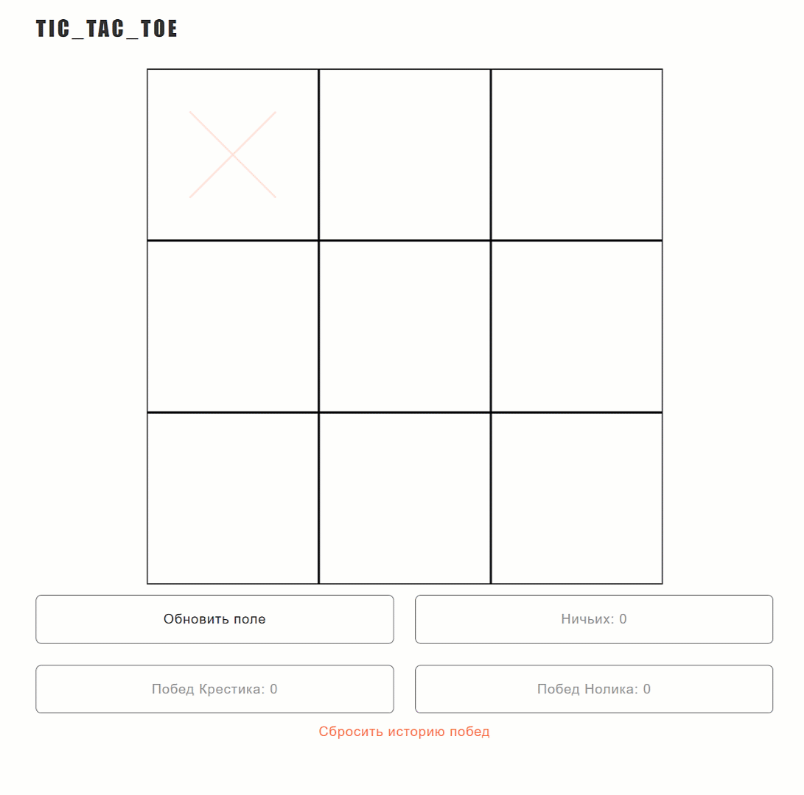

# Wildberries L2

### 10. Крестики-нолики

#### Решение задачи

Ссылка: https://wb-l2-tic-tac-toe.vercel.app/

Использованы HTML, CSS, JS, HTML5 Canvas.

Игра позволяет играть двум пользователям на одном устройстве.

Чей сейчас ход отображается подсказкой на canvas.

Игра отслеживает ходы и определяет победителя.

Есть счетчик побед, который можно сбросить вручную.

Текущий прогресс игры сохраняется в localStorage.

При восстановлении игорового прогресса выводится сообщение, что история восстановлена.

При изменении размера окна canvas масштабируется правильно.

#### Превью

#### Трудности

Трудностей не возникло.
